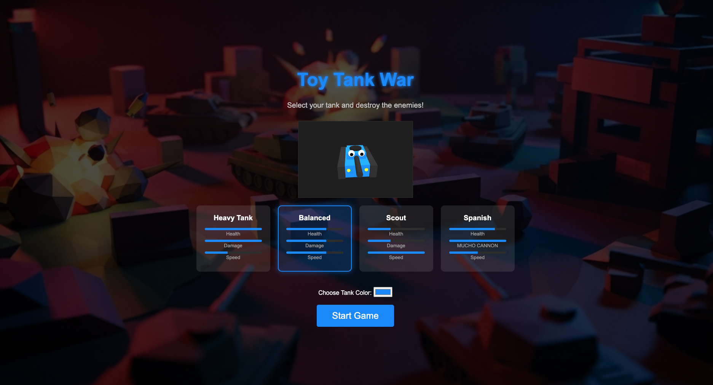
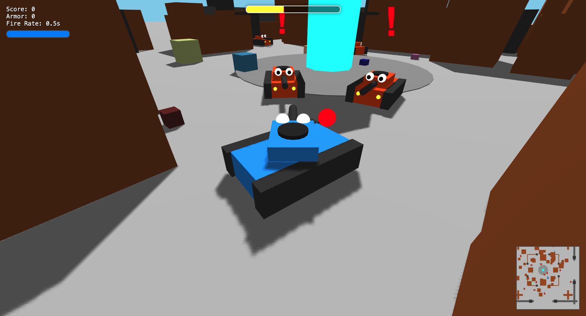

# Toy Tank War

A 3D tank battle game built with Three.js.





## How to Run Locally

Because this project uses JavaScript ES Modules (`import`/`export`), you cannot simply open `index.html` directly in your browser due to security restrictions (CORS). You must serve the files using a local web server.

### Option 1: Using Python (Recommended for macOS/Linux)

If you have Python 3 installed (standard on macOS):

1. Run the server:
   ```bash
   python3 -m http.server
   ```
2. Open your browser and go to `http://localhost:8000`.

### Option 2: Using Node.js

If you have Node.js installed:

1. Run `npx http-server`:
   ```bash
   npx http-server .
   ```
2. Follow the link shown in the terminal (usually `http://127.0.0.1:8080`).

## Controls

- **WASD** or **Arrow Keys**: Move the tank.
- **Space**: Shoot.

## TODO

- Add skills points where you can customize the tank and prioritize what you want, speed,
  fire power, health, armor(hits takes less health), manuability, and of course the stetic of the tank, etc.
- Multiplayer
- Add chat
